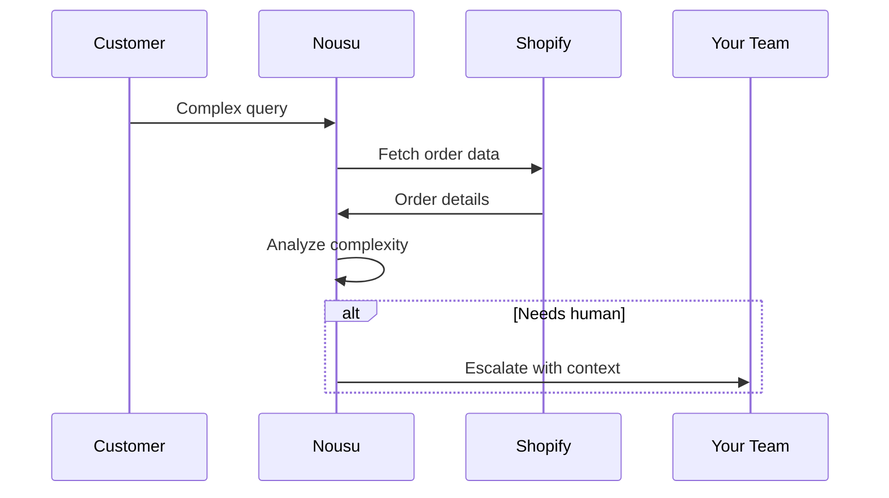

## Overview

Nousu transforms your Shopify customer support from reactive chaos to proactive efficiency. Handle high-volume "Where Is My Order?" (WISMO) queries automatically, process returns in seconds, convert routine FAQs into upsell opportunities, and escalate complex cases seamlessly to your team. Integrate once via Shopify webhooks, and Nousu manages the rest using AI trained on your product catalog and store data.

<Callout kind="success">
Nousu reduces repetitive tickets by up to 80%, freeing your team for high-value interactions.
</Callout>

## Key Features at a Glance

<Columns cols={2}>
  <Card title="WISMO Automation" icon="package" href="#wismo">
    Automatically respond to order status inquiries using real-time Shopify data.
  </Card>
  <Card title="15-Second Returns" icon="arrow-left-right" href="#returns">
    Guide customers through returns without agent intervention.
  </Card>
  <Card title="FAQ Upsell" icon="shopping-cart" href="#upsell">
    Turn support chats into personalized product recommendations.
  </Card>
  <Card title="Smart Escalations" icon="user-check" href="#escalations">
    Route complex issues to humans with full context in under 60 seconds.
  </Card>
</Columns>

## Automate Order Status (WISMO)

WISMO queries overwhelm support during peaks. Nousu checks Shopify order status via webhooks and responds instantly with tracking details, ETAs, and proactive updates.

### Setup Workflow

<Steps>
  <Step title="Configure Webhook" icon="settings">
    In your Shopify admin, set up an `orders/updated` webhook pointing to your endpoint.
  </Step>
  <Step title="Forward to Nousu" icon="arrow-right">
    Relay events to Nousu API.
  </Step>
  <Step title="Enable Auto-Responses" icon="check-circle">
    Toggle WISMO handling in your Nousu dashboard.
  </Step>
</Steps>

<CodeGroup tabs="Node.js,Python">
  ```javascript
  const express = require('express');
  const app = express();
  app.use(express.json());

  app.post('/shopify-webhook', async (req, res) => {
    const order = req.body;
    await fetch('https://api.example.com/nousu/webhooks/order-updated', {
      method: 'POST',
      headers: { 'Authorization': `Bearer ${YOUR_API_KEY}` },
      body: JSON.stringify(order)
    });
    res.status(200).send('OK');
  });
  ```
  ```python
  from flask import Flask, request
  import requests

  app = Flask(__name__)

  @app.route('/shopify-webhook', methods=['POST'])
  def webhook():
      order = request.json
      requests.post(
          'https://api.example.com/nousu/webhooks/order-updated',
          headers={'Authorization': f'Bearer {YOUR_API_KEY}'},
          json=order
      )
      return 'OK', 200
  ```
</CodeGroup>

## Streamline Return Workflows

Process returns end-to-end without manual tickets. Nousu verifies eligibility, generates labels, and updates inventory automatically.

<Tabs>
  <Tab title="Customer Experience" icon="user">
    Customers initiate returns via chat. Nousu collects details and confirms in 15 seconds.
  </Tab>
  <Tab title="Your Workflow" icon="settings">
    Auto-approve valid returns, notify warehouse, and sync Shopify status.
  </Tab>
</Tabs>

<Callout kind="tip">
Test returns with sandbox mode to ensure smooth integration before going live.
</Callout>

## Convert FAQs to Upsell Opportunities

Nousu analyzes queries like "It's too cold at night" against your catalog, recommending products like "warm duvets" with buy links—increasing conversions by 15%.

### Example Interaction

```
Customer: Ik heb het 's nachts altijd koud in bed.
Nousu: Ik begrijp dat! Probeer ons warm dekbed voor optimale comfort. [Koop nu]
```

<Expandable title="Advanced Product Matching" default-open="false">
Configure custom rules for category-based recommendations.

```javascript
// In Nousu dashboard API
POST https://api.example.com/nousu/rules
{
  "trigger": "cold bed",
  "recommend": ["warm-duvet", "heated-blanket"]
}
```
</Expandable>

## Smart Case Escalations

For nuanced issues, Nousu gathers context (order history, chat transcript) and escalates to your team via Slack/email with one click.



## Next Steps

<Columns cols={3}>
  <Card title="Quickstart" icon="rocket" href="/quickstart">
    Set up Nousu in 10 minutes.
  </Card>
  <Card title="Authentication" icon="lock" href="/authentication">
    Secure your API integration.
  </Card>
  <Card title="Dashboard" icon="monitor" href="https://dashboard.example.com">
    Manage rules and analytics.
  </Card>
</Columns>

<Callout kind="info">
Ready to automate? Start your free trial at [nousu.nl/signup](https://nousu.nl/signup).
</Callout>